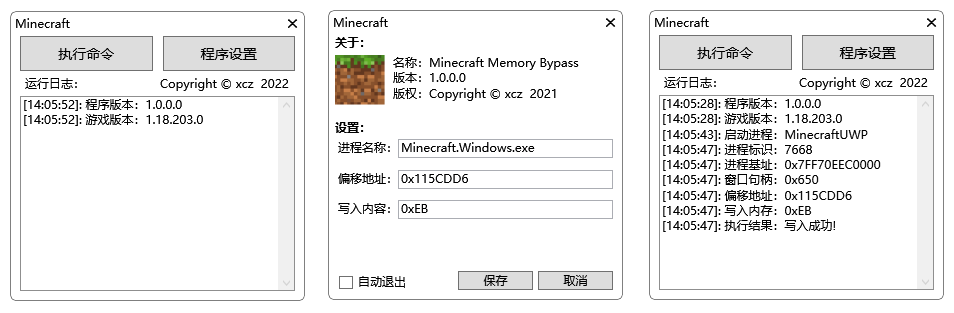

### Minecraft_Memory_Bypass_GUI

绕过Minecraft for Windows 10我的世界UWP验证系统

### 请支持正版！

www.Minecraft.net

一次购买终身享受 请务必支持正版!!!

通过替换DLL实现绕过参见： https://github.com/xingchuanzhen/Minecraft-Unlock

通过禁用服务实现绕过参见：https://github.com/xingchuanzhen

通过修改内存实现绕过参见：https://github.com/xingchuanzhen/Minecraft_Memory_Bypass

### 介绍

通过修改指定内存的方式绕过试玩验证，相比其他两种方法更加简便

不用修改系统设置，程序也不需要申请管理员权限，启动速度快，不会导致系统出现问题

### 使用方法

打开程序，在设置配置好的情况下，单击“执行命令”等待游戏启动，写入内存完毕

### 命令行调用

         [Implement_YES]  <Interface_NO>

         命令解释：

         [必须]
         Implement_YES   启动并执行程序

         <可选>
         Interface_NO    不显示图形化界面
         
### 写到最后：

 编译后的程序链接：

 蓝奏云：https://wwe.lanzouy.com/b01p1esmh 密码:6tz3

 本程序遵循GPL ( GNU General Public License )开源许可协议，程序仅供学习交流，严禁商用或其他非法用途！

